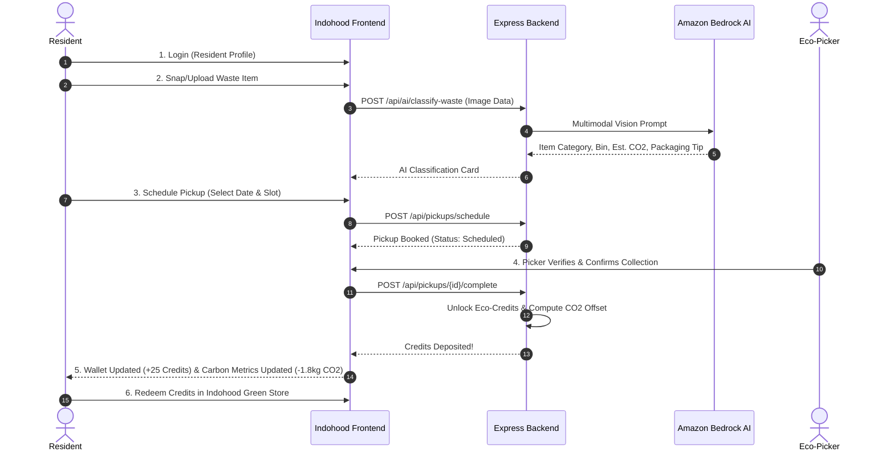
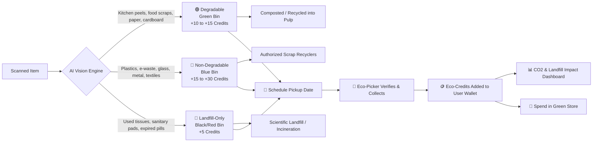

# Indohood (इण्डोहूड) — System Architecture 🏛️

**Indohood** is an AI-powered household waste segregation, smart pickup scheduling, and civic green-credits ecosystem designed for **Track 03 (Waste & Energy)** of the **WeMakeDevs & AWS Environmental Hacks**.

---

## 1. End-to-End User Lifecycle & Architecture

The system executes the complete closed-loop lifecycle:
1. **User Authentication**: Resident & Eco-Picker profiles.
2. **AI Waste Scan**: Amazon Bedrock Multimodal Vision identifies item & classifies it into 3 streams (🟢 Degradable, 🔵 Non-Degradable, 🔴 Landfill-Only).
3. **Pickup Scheduling**: Resident schedules a waste collection date, time slot, and address.
4. **Picker Verification**: Eco-picker arrives, inspects segregation, weighs bag, and marks collection verified.
5. **Instant Eco-Credits Wallet Accrual**: Upon picker verification, Eco-Credits are unlocked directly into the user's wallet.
6. **Carbon & Environmental Impact Analytics**: Live dashboard showing cumulative $CO_2$ emissions avoided (kg), landfill diverted (kg), and equivalent trees saved.
7. **Green Rewards Store**: Redeem credits for 100% free sustainable goods or deep co-pay discounts.



---

## 2. Waste Classification Streams & Credit Economics

Indohood categorizes every scanned item into **3 strictly separated streams**:



### Stream Details:
1. 🟢 **Degradable (Green Bin)**:
   - *Items*: Kitchen waste, vegetable peels, leftover food, paper bags, cardboard, tea leaves, fallen leaves.
   - *Impact*: Diverted from methane-producing landfills to aerobic compost or paper recycling.
   - *Reward*: **+10 to +15 Eco-Credits** upon verified pickup.
2. 🔵 **Non-Degradable (Blue Bin)**:
   - *Items*: Single-use plastic bottles, milk pouches, glass bottles, aluminum cans, cables, discarded electronics, worn fabrics.
   - *Impact*: Diverted to circular material recycling streams.
   - *Reward*: **+15 to +30 Eco-Credits** upon verified pickup.
3. 🔴 **Mixed / Landfill-Only (Red/Black Bin)**:
   - *Items*: Expired medicines (blister packs), sanitary napkins, used tissues, multi-layer laminated chip packets that cannot be separated.
   - *Impact*: Prevented from contaminating organic compost; marked for safe incineration or controlled disposal.
   - *Reward*: **+5 Eco-Credits** upon verified pickup.

---

## 3. Data Schema & API Contract

### 1. Waste Classification Endpoint: `POST /api/ai/classify-waste`
```json
{
  "success": true,
  "itemName": "Single-Use Plastic Bottle",
  "category": "non-degradable",
  "categoryLabel": "Non-Degradable (Recyclable)",
  "binColor": "blue",
  "binName": "Blue Dry Waste Bin",
  "confidence": 0.98,
  "disposalInstructions": [
    "Empty and rinse any residual liquid",
    "Crush the bottle to save collection space",
    "Keep in blue dry bag ready for pickup"
  ],
  "creditsAwarded": 20,
  "environmentalImpact": {
    "weightGrams": 25,
    "co2PreventedGrams": 75,
    "landfillDiverted": true
  }
}
```

### 2. Pickup Scheduling Endpoint: `POST /api/pickups/schedule`
```json
{
  "itemId": "item_123",
  "pickupDate": "2026-10-10",
  "timeSlot": "Morning (9:00 AM - 12:00 PM)",
  "address": "Flat 402, Green Valley Apts, New Delhi",
  "notes": "Keep near main door"
}
```

### 3. Picker Completion Endpoint: `POST /api/pickups/:id/complete`
```json
{
  "actualWeightKg": 1.25,
  "verificationNotes": "Correctly segregated in blue bag",
  "pickerId": "picker_raju"
}
```
**Response**:
```json
{
  "success": true,
  "status": "COMPLETED",
  "creditsAwarded": 25,
  "co2PreventedKg": 1.88,
  "newWalletBalance": 165
}
```

---

## 4. AWS Services & Compliance Matrix

| Service | Role in Indohood | Hackathon Justification |
| :--- | :--- | :--- |
| **Amazon Bedrock** | Multimodal Vision (Claude 3.5 Sonnet / Nova Pro) | Instantly detects waste condition, material grade, and bin stream with Indian civic context. |
| **Amazon S3** | Image and Audit Proof Storage | Stores waste verification records for corporate ESG auditing. |
| **AWS Amplify / App Runner** | Application Hosting | Scalable, high-availability web delivery. |
| **AWS IAM** | Security & Access Governance | Role-based credential isolation for hackathon development. |
| **Agent Toolkit for AWS** | AI Assisted Development | Accelerated prototyping with official AWS best practices. |

---

## 5. Resilience & Zero-Fail Pitch Architecture
1. Bedrock API called with automated connection retries and a 4.5-second timeout.
2. If Amazon Bedrock experiences network latency or quota restrictions, the built-in intelligent fallback matching engine resolves the item from its semantic taxonomy database without throwing an error.
3. 1-Click **"Simulate Picker Collection"** toggle enables single-screen demo during 3-minute hackathon video recordings.
