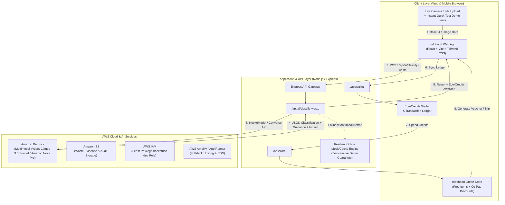
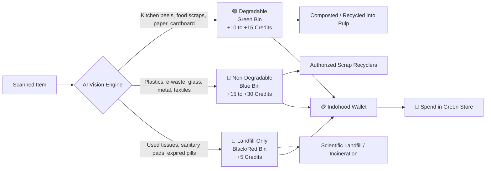
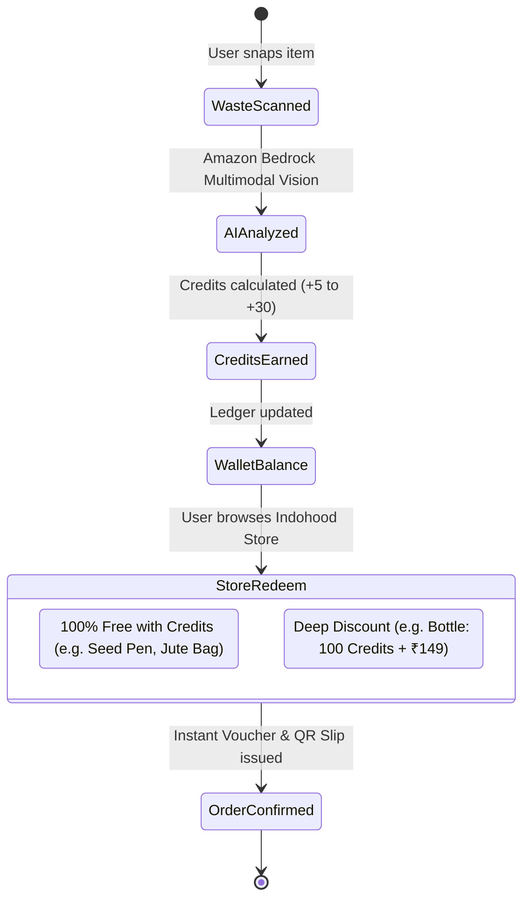

# Indohood (इण्डोहूड) — System Architecture 🏛️

**Indohood** is an AI-powered household waste segregation and civic green-credits ecosystem designed for **Track 03 (Waste & Energy)** of the **WeMakeDevs & AWS Environmental Hacks**.

---

## 1. High-Level System Architecture



---

## 2. Waste Classification Streams & Credit Economics

Indohood categorizes every scanned item into **3 strictly separated streams**:



### Stream Details:
1. 🟢 **Degradable (Green Bin)**:
   - *Items*: Kitchen waste, vegetable peels, leftover food, paper bags, cardboard, tea leaves, fallen leaves.
   - *Impact*: Diverted from methane-producing landfills to aerobic compost or paper recycling.
   - *Reward*: **+10 to +15 Eco-Credits**
2. 🔵 **Non-Degradable (Blue Bin)**:
   - *Items*: Single-use plastic bottles, milk pouches, glass bottles, aluminum cans, cables, discarded electronics, worn fabrics.
   - *Impact*: Diverted to circular material recycling streams.
   - *Reward*: **+15 to +30 Eco-Credits** (higher incentive for high-durability pollutants like e-waste & plastic).
3. 🔴 **Mixed / Landfill-Only (Red/Black Bin)**:
   - *Items*: Expired medicines (blister packs), sanitary napkins, used tissues, multi-layer laminated chip packets that cannot be separated.
   - *Impact*: Prevented from contaminating organic compost; marked for safe incineration or controlled disposal.
   - *Reward*: **+5 Eco-Credits** (incentivizes responsible non-dumping).

---

## 3. Data Schema & API Contract

### Waste Classification Endpoint: `POST /api/ai/classify-waste`

**Request Body**:
```json
{
  "image": "data:image/jpeg;base64,...", // Optional if using demo item
  "demoId": "plastic_bottle"             // Optional preset item for demo pitching
}
```

**Response Body**:
```json
{
  "success": true,
  "itemName": "Single-Use Plastic Bottle",
  "category": "non-degradable",
  "categoryLabel": "Non-Degradable (Recyclable)",
  "binColor": "blue",
  "binName": "Blue Dry Waste Bin",
  "confidence": 0.98,
  "disposalInstructions": [
    "Empty and rinse any residual liquid",
    "Crush the bottle to save collection space",
    "Screw the cap back on or place in dry bin"
  ],
  "creditsAwarded": 20,
  "environmentalImpact": {
    "weightGrams": 25,
    "co2PreventedGrams": 75,
    "landfillDiverted": true,
    "funFact": "Recycling 1 plastic bottle saves enough energy to power a 60W bulb for 3 hours!"
  },
  "aiEngine": "Amazon Bedrock (anthropic.claude-3-5-sonnet / amazon.nova-pro-v1:0)",
  "timestamp": "2026-10-08T14:20:00Z"
}
```

---

## 4. Eco-Credits Wallet & Store Mechanics



---

## 5. AWS Services & Compliance Matrix

| Service | Role in Indohood | Hackathon Justification |
| :--- | :--- | :--- |
| **Amazon Bedrock** | Multimodal Vision (Claude 3.5 Sonnet / Nova Pro) | Instantly detects waste condition, material grade, and bin stream with Indian civic context. |
| **Amazon S3** | Image and Audit Proof Storage | Stores waste verification records for corporate ESG auditing. |
| **AWS Amplify / App Runner** | Application Hosting | Scalable, high-availability web delivery. |
| **AWS IAM** | Security & Access Governance | Role-based credential isolation for hackathon development. |
| **Agent Toolkit for AWS** | AI Assisted Development | Accelerated prototyping with official AWS best practices. |

---

## 6. Resilience & Zero-Fail Pitch Architecture
During hackathon pitch sessions, live Wi-Fi drops or API rate-limits can jeopardize demos. Indohood implements a **Fail-Soft Architecture**:
1. Bedrock API called with a 4.5-second connection timeout.
2. If Amazon Bedrock experiences network latency or quota restrictions, the built-in intelligent fallback matching engine resolves the item from its semantic taxonomy database without throwing an error.
3. Judges witness a smooth, unblocked user experience with accurate classification and credit accrual.
