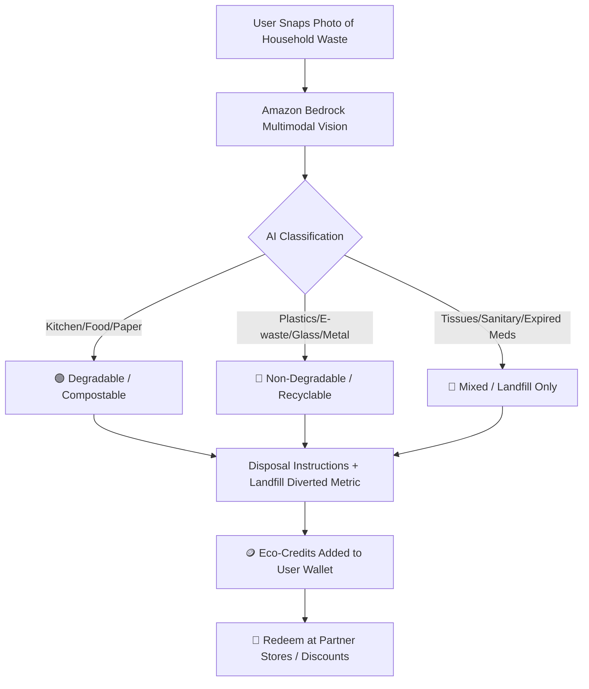

# Implementation Plan — Dobara: AI Household Waste Segregation & Green Credits

**Hackathon**: **Environmental Hacks** (Event 02 of the **Bharat Builds Tour** by WeMakeDevs & AWS)  
**Track**: **Track 03: Waste and Energy** (Focus: *Segregation, Recycling, E-waste, Community Nudges*)  
**Prize Target**: ₹2,00,000 cash + $2,000 AWS Credits + Fast-Track Interviews at Amazon (Top 10 students across tracks)  
**Tagline**: *"Kachra alag karo, Eco-Credits pao, shopping par bachao!"*  
**Core Thesis**: *"Reuse aur Segregation sabse sasti climate action hai."* AI eliminates segregation confusion in 1 second, and Eco-Credits turn civic responsibility into tangible monetary savings.

---

## 0. Hackathon Rules & Submission Compliance Checklist

Based on official rules at `https://www.wemakedevs.org/aws/env/rules`:
- [x] **Track Alignment**: Fully aligned with **Track 03 (Waste & Energy)**: Tackles the exact stated challenge of *household waste segregation, recycling streams, and landfill reduction*.
- [x] **Mandatory AWS Integration**: The project **MUST use AWS** and clearly demonstrate it in the video (Amazon Bedrock for Multimodal AI classification, AWS Amplify/App Runner for deployment, S3 for storage).
- [x] **Execution Over Perfection**: Judges explicitly state: *"One feature that runs beats five that almost do."* The Core Loop (Scan $\rightarrow$ Classify $\rightarrow$ Wallet Credits $\rightarrow$ Store Redeem) must work flawlessly.
- [x] **AI Tools Transparency**: Disclose AI coding assistance (Antigravity & Agent Toolkit for AWS) in the project writeup as explicitly encouraged in the rules.
- [x] **Submission Requirements** (Deadline: Sunday, Oct 11):
  1. **Public GitHub Repository** with clear README, architecture diagram, and setup instructions.
  2. **YouTube Demo Video ($\le$ 3 minutes)**: Public/Unlisted video demonstrating live waste scanning, AWS Bedrock processing, credit accrual, and store redemption.
  3. **Short Technical Writeup**: Detailing problem statement, impact metrics, and AWS services used.

---

## 1. Waste Classification Hierarchy

The AI engine classifies household items into **3 distinct streams**:

| Stream | Color / Bin | Item Types | What Happens to It | Credit Reward |
| :--- | :--- | :--- | :--- | :--- |
| 🟢 **Degradable** | Green Bin | Wet kitchen waste, food scraps, vegetable peels, paper, cardboard, wood, garden leaves | Composted into manure or recycled into paper pulp | **+10 to +15 Credits** |
| 🔵 **Non-Degradable** | Blue Bin | Plastic bottles/pouches, glass jars, metals/cans, e-waste (cables, old phones), textiles | Sent to authorized recyclers & scrap vendors | **+15 to +30 Credits** |
| 🔴 **Mixed / Landfill-only** | Black/Red Bin | Used toilet tissues, sanitary napkins/diapers, expired medicines, composite wrappers | Scientific incineration or deep-landfill containment | **+5 Credits** *(Responsible disposal)* |



---

## 2. Proposed System Architecture

### Frontend (Next.js / Vite React + Tailwind CSS)
1. **Hero & Live Impact Dashboard**:
   - Total waste segregated (kg), Landfill diversion rate (%), and Total Eco-Credits distributed.
   - Quick "One-Click Quick Test" buttons with preset household items for instant judge demos (e.g. *Banana Peel*, *Plastic Bottle*, *Expired Medicine*, *Cardboard Box*).
2. **AI Waste Scanner Page (`/scan`)**:
   - Camera view / File upload / Drag-and-drop.
   - Live AI Scanner animation.
   - **Result Card**:
     - Item Identified (e.g. *"Single-use Plastic Milk Pouch"*).
     - Category Badge (🟢 Degradable / 🔵 Non-Degradable / 🔴 Mixed).
     - Step-by-step Disposal Instruction (e.g., *"Rinse with water, cut only a slit, and put in Blue Dry Bin"*).
     - Environmental Saving (*"Diverted 25g plastic from oceans"*).
     - **Coins Earned Animation** (e.g., *"+20 Eco-Credits added to your wallet!"*).
3. **Eco-Credits Wallet (`/wallet`) & Real-Time Balance**:
   - Header shows persistent live wallet badge (e.g., **🪙 240 Eco-Credits**).
   - Real-time ledger / transaction history:
     - `+20 Credits` — Plastic Bottle segregation (Blue Bin)
     - `+15 Credits` — Kitchen Compost segregation (Green Bin)
     - `-100 Credits` — Redeemed Recycled Jute Bag
4. **Dobara Direct Rewards Store (`/store`)**:
   - Items can be redeemed directly from Dobara in two ways:
     - 🎁 **100% Free with Credits** (e.g., Plantable Seed Pen: 40 Credits + ₹0, Recycled Notebook: 80 Credits + ₹0, Cloth Tote Bag: 120 Credits + ₹0).
     - ⚡ **Credits + Cash Co-pay** (e.g., Stainless Steel Water Bottle: 100 Credits + ₹149 [MRP ₹499], Home Compost Bin Kit: 150 Credits + ₹299 [MRP ₹799], Organic Groceries Hamper: 200 Credits + ₹249).
   - Dynamic redemption checkout modal: verifies wallet balance, applies credit discount, shows remaining cash if any, and issues an instant Order Confirmation & Delivery Slip!
5. **Segregation History / Log (`/history`)**:
   - Visual feed of previously scanned items, timestamps, and streak tracker.

---

### Backend & AI Vision Engine (Express + Bedrock SDK)
1. **AI Route (`/api/ai/classify-waste`)**:
   - Accepts image base64 or photo URL.
   - Prompts Amazon Bedrock Claude 3.5 Sonnet / Nova multimodal model:
     ```json
     {
       "itemName": "Plastic Water Bottle",
       "category": "non-degradable",
       "categoryLabel": "Non-Degradable (Recyclable)",
       "binColor": "blue",
       "confidence": 0.96,
       "disposalTip": "Crush the bottle and place cap on. Deposit in Blue Bin for plastic recycling.",
       "creditsAwarded": 20,
       "impact": {
         "weightGrams": 30,
         "co2PreventedGrams": 85,
         "landfillDiverted": true
       }
     }
     ```
   - Resilient offline fallback with predefined catalogue so demo **never stumbles** even without internet or Bedrock quota limits.
2. **Wallet & Store API (`/api/wallet`, `/api/store/redeem`)**:
   - Manages credit balance, history logs, and voucher issuance.

---

## 3. Demo Readiness & Judge Presentation

### Pre-configured Demo Items (Zero-fail guarantee during pitching)
1. **Vegetable Peels / Food Scraps** $\rightarrow$ 🟢 Degradable (Compost) $\rightarrow$ +15 Credits
2. **Amazon Delivery Box / Paper** $\rightarrow$ 🟢 Degradable (Paper recycling) $\rightarrow$ +10 Credits
3. **Plastic Beverage Bottle** $\rightarrow$ 🔵 Non-Degradable (Plastic) $\rightarrow$ +20 Credits
4. **Discarded USB Cable / Old Charger** $\rightarrow$ 🔵 Non-Degradable (E-waste) $\rightarrow$ +30 Credits
5. **Used Tissue Paper / Wet Wipes** $\rightarrow$ 🔴 Mixed / Landfill-only $\rightarrow$ +5 Credits
6. **Expired Medicine Strip (Blister Pack)** $\rightarrow$ 🔴 Mixed / Hazardous (Landfill/Incineration) $\rightarrow$ +5 Credits

---

## 4. User Review Required

> [!IMPORTANT]
> **Store Credits Mechanism**: For the hackathon MVP, we will simulate the Partner Store redemption with interactive discount coupon generation (instant QR code + promo code reveal). Does that match your vision for how users spend their credits?

---

## 5. Verification Plan

### Automated / API Verification
- Test `/api/ai/classify-waste` with test samples representing all 3 categories (Degradable, Non-Degradable, Mixed).
- Test `/api/wallet` credit accrual and `/api/store/redeem` voucher generation.

### Manual / Live Demo Verification
1. Open Dobara homepage $\rightarrow$ inspect clean waste-management branding and live impact stats.
2. Scan a sample item (e.g. plastic bottle) $\rightarrow$ verify AI classifies as **🔵 Non-Degradable**, gives proper disposal advice, and credits wallet +20.
3. Scan a used tissue $\rightarrow$ verify AI classifies as **🔴 Mixed (Landfill-only)**.
4. Go to **Rewards Store** $\rightarrow$ click "Redeem ₹50 Kirana Voucher" using 100 credits $\rightarrow$ verify balance deducts and discount voucher appears with confetti.
