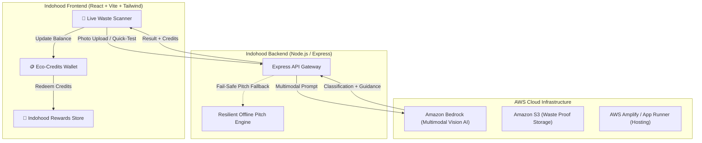

# Indohood (इण्डोहूड) 🌱

> **"Kachra alag karo, Eco-Credits pao, shopping par bachao!"**  
> *AI-Powered Household Waste Segregation, Circular Recycling & Green Rewards Ecosystem.*

[](https://aws.amazon.com/bedrock/)
[](https://www.wemakedevs.org/aws/env)
[]()

---

## 🏆 Hackathon Context

- **Event**: **Environmental Hacks** (Event 02 of the **Bharat Builds Tour** by WeMakeDevs & AWS)
- **Track**: **Track 03: Waste and Energy**
- **Core Challenge**: Household waste segregation at source, landfill diversion, recycling streams, and civic engagement nudges.
- **Project Name**: **Indohood** (`indohood`)

---

## 💡 The Core Thesis

> *"Reuse aur Segregation sabse sasti climate action hai."*

Over **70% of urban Indian waste** ends up in landfills not because it can't be recycled, but because it arrives mixed. Households lack instant clarity on which bin an item belongs to, and there is zero direct economic incentive to segregate properly.

**Indohood changes this in 3 steps:**
1. 📸 **Instant 1-Second AI Scan**: Point phone camera at any waste item — Amazon Bedrock multimodal vision immediately categorizes it.
2. 🗑️ **Precise 3-Stream Segregation**: Clear disposal instructions (🟢 Degradable, 🔵 Non-Degradable, or 🔴 Landfill-Only) with carbon diversion stats.
3. 🪙 **Real Monetary Value (Eco-Credits)**: Earn credits for every verified segregation, redeemable for 100% free sustainable products or high-value store discounts.

---

## 🏛️ System Architecture

Full technical specifications and data contracts are documented in [ARCHITECTURE.md](ARCHITECTURE.md).



---

## ♻️ The 3 Segregation Streams

| Stream | Color / Bin | Household Items | Action & Destination | Eco-Credit Reward |
| :--- | :--- | :--- | :--- | :--- |
| 🟢 **Degradable** | **Green Bin** | Wet kitchen waste, food scraps, vegetable peels, paper, cardboard, leaves | Aerobic composting into organic manure / paper pulp | **+10 to +15 Credits** |
| 🔵 **Non-Degradable** | **Blue Bin** | Plastic bottles, milk pouches, glass, metals, e-waste, cables, fabrics | Authorized scrap recyclers & circular economy | **+15 to +30 Credits** |
| 🔴 **Mixed / Landfill-Only** | **Black/Red Bin** | Used toilet tissues, sanitary napkins, expired medicine strips | Safe sanitary incineration or deep landfill | **+5 Credits** |

---

## 🪙 Indohood Green Rewards Store

Users convert good civic habits into tangible everyday savings:
- 🎁 **100% Free with Credits**: Plantable seed pens (40 credits), recycled spiral notebooks (80 credits), organic cotton tote bags (120 credits).
- ⚡ **Credits + Cash Co-pay**: Stainless steel insulated bottles (100 credits + ₹149 [MRP ₹499]), Bokashi home composting bin kit (150 credits + ₹299 [MRP ₹799]), organic grocery essentials hamper (200 credits + ₹249).

---

## ☁️ AWS Services Used

- **Amazon Bedrock**: Powering multimodal visual inspection using `anthropic.claude-3-5-sonnet` and `amazon.nova-pro-v1:0` to identify mixed materials and generate Indian-localized disposal instructions.
- **Amazon S3**: Secure cloud storage for scanned waste receipts and verification proofs.
- **AWS Amplify / AWS App Runner**: Production hosting for frontend and API microservices.
- **AWS IAM**: Role-based developer credential management (`hackathon-dev`).
- **Agent Toolkit for AWS**: Integrated AWS skill suites for seamless cloud orchestration.

---

## 🚀 Getting Started

### Prerequisites
- Node.js `v20+` or `v24+`
- AWS Account configured with Bedrock access (`ap-southeast-2` or `us-east-1`)

### Repository Structure
```
Indohood/
├── frontend/   # React 19 + Vite + Tailwind CSS Web Application
├── backend/    # Express.js REST API Server with Amazon Bedrock Integration
└── database/   # Relational SQL Schemas, JSON Seeds & Persistence Engine
```

### Local Setup
```bash
# 1. Install dependencies for all tiers
npm run install:all

# 2. Run the frontend (Vite dev server on port 5173)
npm run dev:frontend

# 3. Run the backend (Express API on port 5000)
npm run dev:backend
```

---

## 👥 Team & Submission
- **Project**: Indohood
- **Built for**: Environmental Hacks — WeMakeDevs & AWS Bharat Builds Tour
