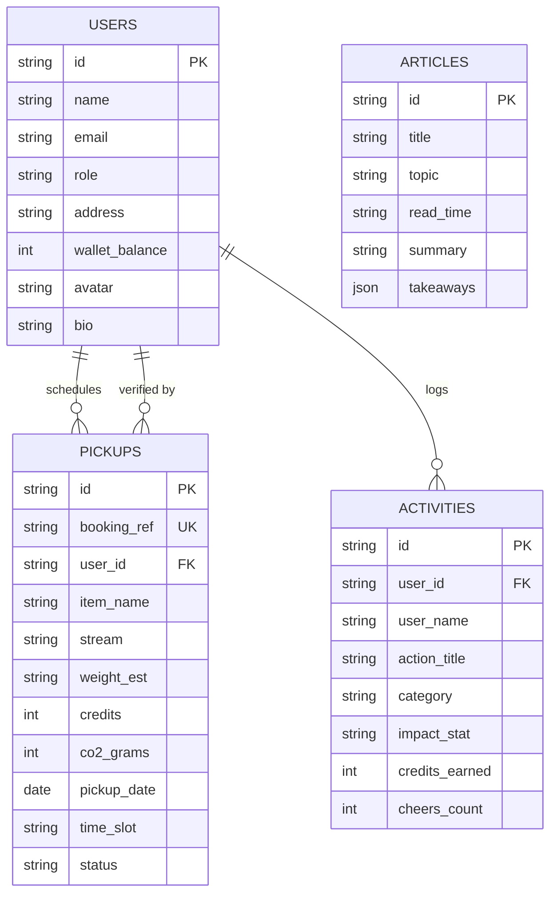

# IndoHood Database Layer 🗄️

The `database/` directory houses the data schemas, seed datasets, and persistence abstraction layer for **IndoHood**.

## Directory Layout

```
database/
├── schema.sql           # Standard SQL DDL for enterprise relational databases (PostgreSQL/SQLite)
├── db.js                # Universal persistence query layer (JSON-backed with seed initialization)
├── data/                # Auto-created live persistent records (persisted across restarts)
├── seeds/               # Initial seed files
│   ├── users.json       # Default resident & eco-picker profiles
│   ├── pickups.json     # Default doorstep collection requests
│   ├── activities.json  # Neighborhood segregation activity stream
│   └── articles.json    # Waste awareness short-form educational articles
└── README.md            # This documentation
```

## Relational Entity Model



## Key Query Methods in `db.js`

- **Users**: `getUsers()`, `getUserById(id)`, `updateUser(id, updates)`
- **Pickups**: `getPickups()`, `getPickupById(id)`, `addPickup(data)`, `updatePickup(id, updates)`
- **Activities**: `getActivities()`, `addActivity(data)`, `cheerActivity(id)`
- **Articles**: `getArticles()`, `getArticleById(id)`
